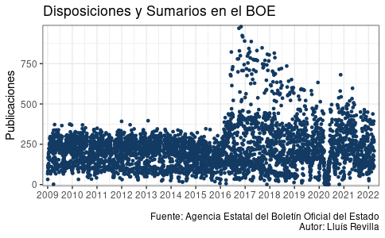

```{r setup, include=FALSE}
knitr::opts_chunk$set(collapse = TRUE)
```


# BOE

Retrieve data from the official Spanish Gazette:

```{r include=FALSE}
if (!requireNamespace("BOE", quietly = TRUE)) {
  install.packages("BOE", repos = c(
    ropenspain = 'https://ropenspain.r-universe.dev',
    CRAN = 'https://cloud.r-project.org'))
}
```

```{r}
library("BOE")
sumario_hoy <- retrieve_sumario(as.Date("2022/05/06")) # Or retrieve_sumario("BOE-S-2022-1")
colnames(sumario_hoy)
```

.center[

```{r, echo = FALSE, out.height=375}
#| fig.alt = "Graphic with years and daily publications on the absciss. 
#| There is a seasonal effect and a big peak of publication around 2017."

```

]

???

Daily summaries can be retrieved by date or CVE. 
Then it is easier to extract information for a publication. 

---

## Examples

.pull-left[

Works for documents which allows to search in text:

```{r paged.print=TRUE}
(CVE <- sumario_hoy$publication[1])
cat(colnames(retrieve_document(CVE)))
cat(colnames(retrieve_document("BORME-S-2022-1")))
```

Many data is available to users which allows to analysis it:

- Date of approval, date of publication
- Department
- Type of publication
- Full text
- Legal status
- ...

]

.pull-right[

For example: looking at publications from the universities:

```{r echo=FALSE, out.height=300}
knitr::include_graphics("https://llrs.github.io/BOE_historico/universidades_files/figure-html/anuncios2-3.png")
```

Almost half of the publications are due to people missing their degrees certificates.

]

.bottom[.center[More examples at: https://llrs.github.io/BOE_historico/]]

???

Of each document all the fields reported by the xml file can be retrieved in a tidy format, which allows for nice analysis, graphs and statistics.


